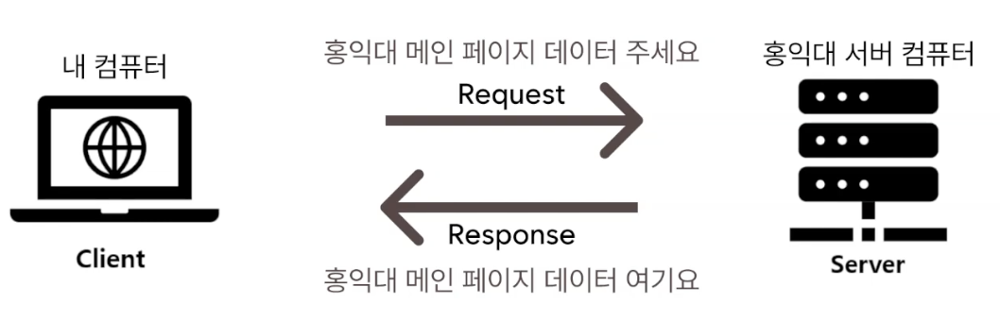
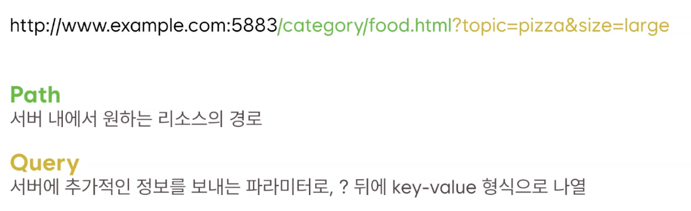
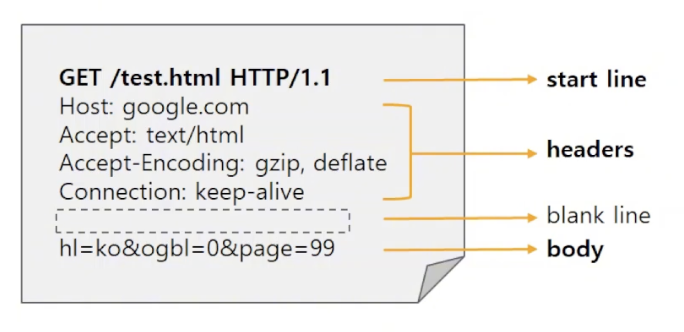
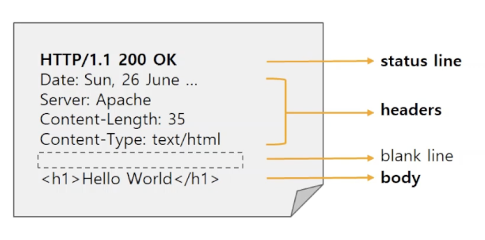

# 웹의 소통 방식, HTTP와 REST API

## 웹이란?
### 인터넷과 웹
- 인터넷: 전 세계 컴퓨터와 기기를 연결하는 거대한 글로벌 네트워크
- 웹: 인터넷 위에서 동작하는 서비스 중 하나이며 인터넷에 연결된 전 세계 사용자들이 서로의 정보를 공유할 수 있는 장소
### 웹의 동작과정
- 클라이언트 - 서버 모델 
  : 컴퓨터와 컴퓨터가 통신하는 구조

- URL
  : 웹 상에서 특정 자원(웹페이지, 문서, 이미지 등)의 위치를 나타내는 주소

 

## HTTP
### HTTP란?
- 웹에서 데이터를 주고받는 서버-클라이언트 모델의 프로토콜
- 클라이언트 요청(request)과 서버의 응답(response)을 통해 작동
### HTTP 특징
- **무상태성(Stateless)**
 : 서버는 클라이언트의 이전 요청을 저장하지 않고, 매 요청을 독립적으로 처리
- **비연결성(Connectionless)** 
 : 클라이언트가 요청을 보내고 응답을 받은 후 서버와 연결을 유지하지 않음
---
### HTTP 요청

- **start line**
  요청 메서드, 요청할 경로, HTTP 버전 정보
- **headers**
  요청에 대한 부가 정보
- **body**
  실제 전송할 데이터 
  ex) 회원가입 시 등록한 아이디와 비밀번호가 body에 담겨져 서버로 전송됨
### HTTP 주요 메서드
- `GET` : 리소스를 조회
- `POST` : 리소스를 추가, 등록
- `PUT` : 리소스를 교체, 없으면 새로 생성
- `PATCH` : 리소스의 일부를 수정
- `DELETE` : 리소스를 삭제
---
### HTTP 응답

- **status line**
  HTTP 버전, HTTP 상태코드, 상태 메시지
- **headers**
  응답에 대한 부가 정보
- **body**
  실제 응답 데이터
### HTTP 주요 상태 코드
- `200 OK` : 요청이 성공적으로 처리됨
- `201 Created` : 요청이 성공적으로 처리되어 새로운 리소스가 생성됨 _(주로 POST 요청에 대한 응답으로 사용됨)_
- `400 Bad Request` : 클라이언트의 요청이 잘못되어 서버가 이해하지 못함
- `404 Not Found` : 지정한 리소스를 찾을 수 없음 
- `500 Internal Server Error` : 서버 내부 오류로 요청을 처리할 수 없음
---
### 문제점
> 페이지를 요청할 때 마다, 서버에서 html 코드 전체를 보내는 방식에는 단점이 있음.
- 웹에서 제공되는 정보량 ↑
 -> html 페이지 자체를 보내주게 되면 서버에 부하 발생 
- 해결점
  : 필요한 데이터만 받아오는 것

 

## API와 REST API
### API (Application Programming Interface)
- 한 프로그램이 다른 프로그램의 기능이나 데이터를 사용할 수 있도록 미리 정해놓은 약속(규칙)이자 소통 창구
- 클라이언트와 서버가 소통할 때 어떻게 요청을 보내고, 어떻게 응답할지 미리 정해놓은 규칙과 기능의 목록
### REST (Representational State Transfer)
- 네트워크 아키텍처 스타일로 HTTP의 장점을 최대한 활용할 수 있는 아키텍처
- REST 구성요소
    - 자원(Resource) - URI
      : 모든 자원은 고유한 ID를 가지며, 이 ID는 `/student/1` 같은 HTTP URI 이다.
    - 행위(Verb) - Method
      : 자원을 조작하기 위해 HTTP Method를 사용한다.
    - 표현(Representation)
      서버와 클라이언트가 데이터를 주고 받는 형식으로, JSON형식이 일반적이다.
### REST API
- 자원(Resource)을 고유한 URI로 식별하고, 해당 자원에 대한 행위(Verb)르 HTTP 메서드로 정의하며, 그 결과를 JSON 같은 표준 형식으로 표현하는 웹 서비스 아키텍처 스타일

 

## RESTful하게 API 설계하기
### API 명세서 작성
> 회원 기능
1. 회원 등록
- HTTP Method : `POST`
- URI : `/members`
2. 회원 리스트 조회
- HTTP Method : `GET`
- URI : `/members`
3. 회원 상세 조회
- HTTP Method : `GET`
- URI : `/members/{memberId}`
4. 회원 정보 수정
- HTTP Method : `PATCH`
- URI : `/members/{memberId}`
5. 회원 삭제
- HTTP Method : `DELETE`
- URI : `/members/{memberId}`
> 상품 기능
1. 상품 정보 등록
- HTTP Method : `POST`
- URI : `/items`
2. 상품 목록 조회
- HTTP Method : `GET`
- URI : `/items`
3. 개별 상품 정보 상세 조회
- HTTP Method : `GET`
- URI : `/items/{itemId}`
4. 상품 정보 수정
- HTTP Method : `PATCH`
- URI : `/items/{itemId}`
5. 상품 삭제
- HTTP Method : `DELETE`
- URI : `/members/{itemId}`
> 주문 기능
1. 주문 정보 생성
- HTTP Method : `POST`
- URI : `/orders`
2. 주문 목록 조회
- HTTP Method : `GET`
- URI : `/orders`
3. 개별 주문 정보 상세 조회
- HTTP Method : `GET`
- URI : `/orders/{orderId}`
4. 주문 취소
- HTTP Method : `DELETE`
- URI : `/orders/{orderId}`